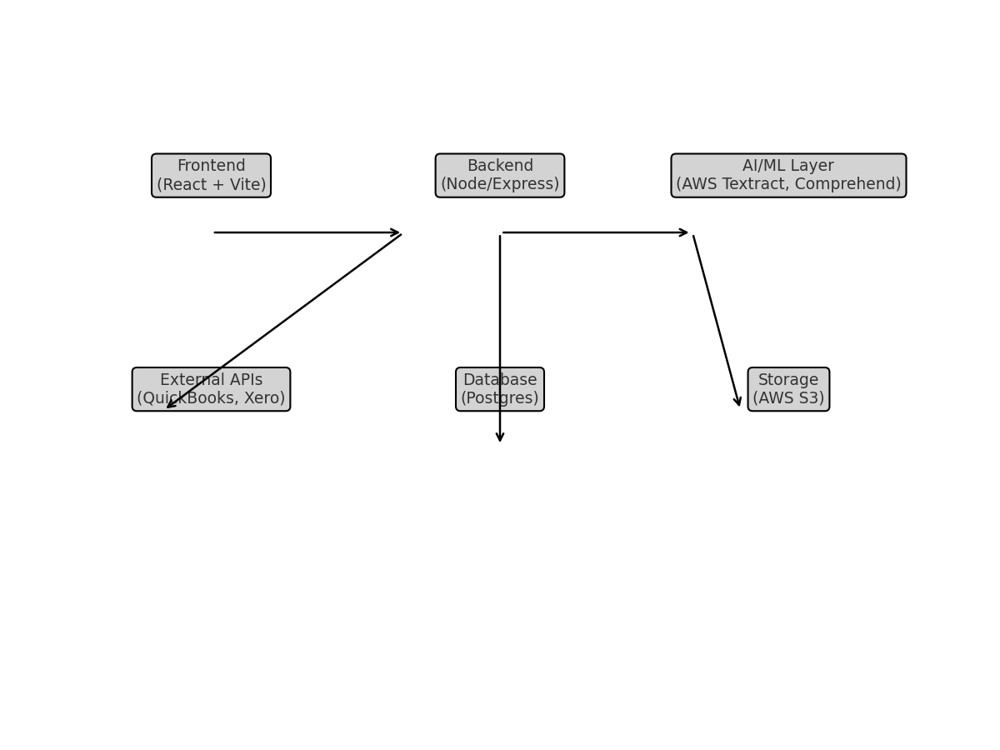

# System Architecture Overview

## High-Level Diagram

## Flow
1. **Frontend (React + Vite)** → handles uploads, parsing status, AI results preview/edit.  
2. **Backend (Node/Express)** → endpoints for file upload, parsing jobs, data sync with QuickBooks/Xero.  
3. **AI/ML Layer** → AWS Textract & Comprehend, custom ML models (future: Bedrock, LayoutLMv3).  
4. **Database (Postgres/Neon → AWS RDS)** → stores users, jobs, parsed data, normalized outputs.  
5. **External APIs** → QuickBooks, Xero, LME/CME price feeds (planned).  
6. **Storage (AWS S3)** → uploaded PDFs, parsed document results.  
