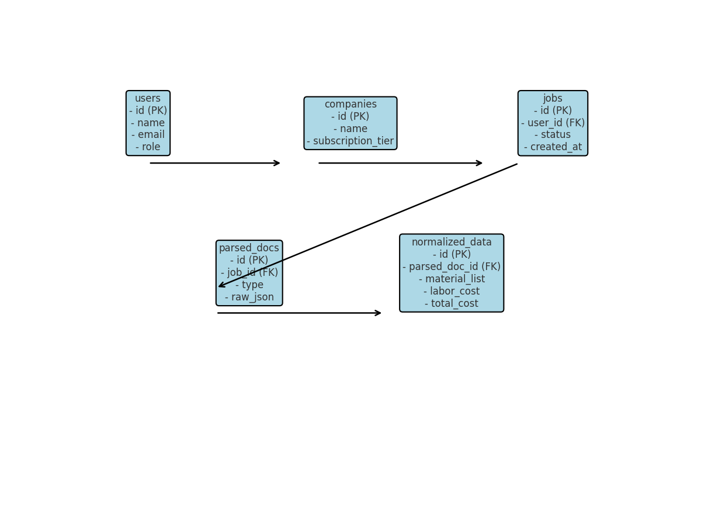

# Database Schema

## Tables
- **users** → id, name, email, role
- **companies** → id, name, subscription_tier
- **jobs** → id, user_id, status, created_at
- **parsed_docs** → id, job_id, type (invoice, quote, bill), raw_json
- **normalized_data** → id, parsed_doc_id, material_list, labor_cost, total_cost
